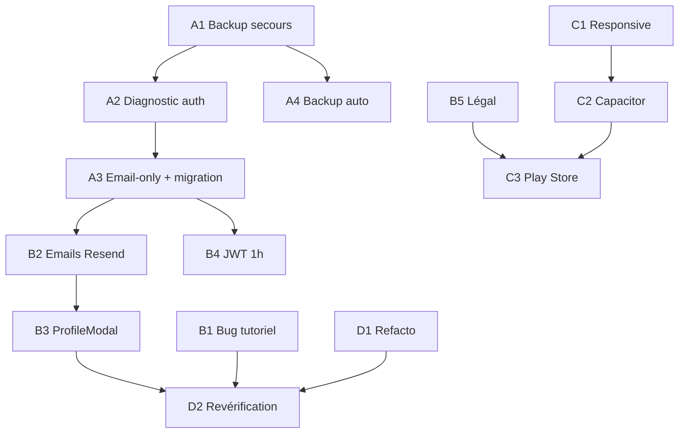

# Blundertale — Roadmap de publication

> Établie le 31/08/2026 · Basée sur un audit complet du code + ressources en ligne (Render, Capacitor, OWASP, Resend, gdpr.eu)
> Objectif : site web ET app mobile **fonctionnels, publiables, aux standards**.
>
> Chaque chantier a son document détaillé dans `docs/`. Ce fichier est le plan maître chronologique.

---

## Comment utiliser cette roadmap

Chaque étape indique :
- **[CODE]** = travail dans le code, à confier à l'agent (le document détaillé contient les modifications précises)
- **[HORS-CODE]** = action manuelle à faire toi-même (dashboard Render, DNS, comptes externes…)
- **[TEST]** = validation manuelle obligatoire avant de passer à la suite

---

## Phase A — Fondations (URGENT, bloquant tout le reste)

### A1. Sauvegarde de secours immédiate — [HORS-CODE] · 10 min · docs/02
Render plan Free = **AUCUN backup automatique**. Avant de toucher à quoi que ce soit :
```bash
pg_dump --dbname=<EXTERNAL_DATABASE_URL> -n public --no-owner > blundertale-2026-08-31.sql
```
(URL externe : dashboard Render → ta DB → Connect → External Database URL)

### A2. Diagnostic de l'accès aux comptes — [HORS-CODE] puis [CODE] · docs/01 §1 + docs/08 C1
**Deux causes candidates** (peuvent coexister) — les logs Render trancheront :
1. `backend/migrate-identity.sql` jamais exécuté → chercher `column "phone" does not exist` (docs/01 §1)
2. **`trust proxy` absent** → chercher `ERR_ERL_UNEXPECTED_X_FORWARDED_FOR` : express-rate-limit v8 derrière le proxy Render renvoie 500 sur /login et /signup (docs/08 C1 — fix : 1 ligne)
3. `psql` sur la DB Render → `\d users` → comparer avec le DDL attendu

### A3. Simplification email-only + migration DB — [CODE] + [HORS-CODE] · docs/01 §2
Décision actée : suppression de l'inscription par téléphone (coût SMS incompatible budget).
- [CODE] Retirer `phone` de 6 fichiers (liste exacte dans docs/01)
- [HORS-CODE] Exécuter le **nouveau** script `migrate-v2-email-only.sql` (fourni dans docs/01) sur Render — il remplace `migrate-identity.sql` qui ne doit PLUS être exécuté tel quel
- [TEST] Signup + login + logout en prod

### A4. Backup automatisé quotidien — [HORS-CODE] + [CODE léger] · docs/02
GitHub Actions planifié (gratuit) : `pg_dump` chiffré chaque nuit. Workflow complet fourni dans docs/02.
- [TEST] Déclencher manuellement le workflow, télécharger l'artefact, restaurer en local

---

## Phase B — Standards web (publiable)

### B0. Corrections critiques de l'audit — [CODE] · docs/08
L'audit vibecoding (docs/08) a révélé 4 autres bugs critiques à corriger avant publication, groupés en lots ordonnés (voir le Mermaid de docs/08) :
- **C2** transaction PostgreSQL factice dans le sync → risque de perte totale des répertoires (recommandation : supprimer l'endpoint mort `PUT /repertoires/sync`)
- **C3** hash bcrypt factice invalide → protection timing-attack inopérante
- **C4** stats d'entraînement cassées en local SQLite
- **H1-H7** : fail-open révocation, bornes de payload absentes (DoS), retries POST dupliquants, merge multi-appareils qui ressuscite les suppressions, PRAGMA foreign_keys, logout non attendu, TOCTOU signup

### B1. Bug tutoriel « naviguer ×5 » — [CODE] · docs/06 §1
✅ **Diagnostic élucidé par analyse statique** : 4 défauts identifiés dans le compteur de l'étape (timeouts `next()` empilés → sauts d'étapes, incrément fantôme, bouton ▶ inerte au départ, indice de répertoire codé en dur) + confusion de numérotation (l'étape ×5 est la 19/22, pas la 20/22). Correctif localisé proposé dans docs/06 §1.

### B2. Emails transactionnels — [HORS-CODE] puis [CODE] · docs/03
- [HORS-CODE] Nom de domaine (~10 €/an, seule dépense), compte Resend gratuit (3 000/mois, 100/jour), DNS DKIM/SPF
- [CODE] `emailService.js` + table `auth_tokens` + 3 flux : vérification email, mot de passe oublié, changement d'email (spécifications OWASP complètes dans docs/03)
- [TEST] Recevoir réellement les 3 types d'emails

### B3. ProfileModal fonctionnel — [CODE] · docs/01 §3
Les 3 boutons sont des stubs (`ProfileModal.tsx:34-36`). Endpoints + composants détaillés dans docs/01.
Inclut la **suppression de compte** (obligation RGPD).

### B4. Durcissement JWT minimal — [CODE] · docs/01 §4
TTL 24h → 1h (ou 12h) + `jti` + retrait de l'email du payload. ⚠️ Conserver la claim `sub` (le middleware en dépend). (La migration refresh-token complète est volontairement reportée post-v1.)

### B5. Mentions légales + politique de confidentialité — [CODE rédactionnel] · docs/05
`LegalPage.tsx` affiche "Page en cours de rédaction". Contenus complets prêts à adapter dans docs/05.
⚠️ Requis AUSSI par Google Play pour l'app mobile.

### B6. Logo + identité TopBar — [CODE léger] · docs/06 §5
`TopBar.tsx:142` a déjà `<div className="brand-logo">A</div>`. Options concrètes dans docs/06.

### B7. SEO / metas de base — [CODE léger] · docs/06 §6
`index.html` n'a NI meta description, NI favicon, NI Open Graph, et le titre dit encore "Beta Fermée".

---

## Phase C — Mobile (Capacitor → Android d'abord)

### C1. Responsive mobile — ✅ largement FAIT · vérification seule · docs/04 §2
Re-vérifié dans le code : `min-width: 900px` supprimé, hamburger ≤ 480 px implémenté (TopBar), drag en Pointer Events, breakpoints 480/768 en place. Reste : validation sur téléphone réel + `viewport-fit`/safe-areas (intégrés au plan Capacitor).

### C2. Intégration Capacitor — [CODE] + [HORS-CODE] · docs/04 §0 (plan d'exécution pas à pas) + §3-4
- [HORS-CODE] Android Studio ≥ 2025.2.1, Node 22+
- [CODE] 5 fichiers à toucher, listés commande par commande dans docs/04 §0 (router conditionnel, viewport, back button, safe areas, CORS multi-origins)
- [TEST] Stockfish WASM sur device Android réel = plus gros risque technique

### C3. Publication Play Store — [HORS-CODE] · docs/04 §6
Compte 25 $ (une fois), Data Safety, fiche store. iOS reporté (nécessite macOS + Xcode 26).

---

## Phase D — Finalisation

### D1. Refacto & nettoyage — [CODE] · docs/06 + docs/08 (dette L1-L10)
Debug logs (6 emplacements re-vérifiés), dossiers legacy `js/`/`engine/` (déjà vides — suppression triviale), `chess.js@0.10.3` backend obsolète (1 seul fichier l'utilise), CI GitHub Actions, typage des `any` de authService.ts/stats.ts.

### D2. Revérification globale — [TEST] · docs/07
Checklist GO/NO-GO complète : parcours utilisateurs, matrice navigateurs, sécurité, perf.

---

## Récapitulatif des actions HORS-CODE (à faire toi-même)

| # | Action | Où | Coût | Phase |
|---|--------|-----|------|-------|
| 1 | `pg_dump` de secours | Terminal local | 0 € | A1 |
| 2 | Lire les logs Render + `\d users` | Dashboard Render | 0 € | A2 |
| 3 | Exécuter `migrate-v2-email-only.sql` | psql → Render | 0 € | A3 |
| 4 | Créer repo privé GitHub + secrets (DATABASE_URL, BACKUP_PASSPHRASE) | GitHub | 0 € | A4 |
| 5 | Acheter un nom de domaine | OVH/Namecheap/… | ~10 €/an | B2 |
| 6 | Compte Resend + vérif domaine + DNS DKIM/SPF | resend.com + registrar | 0 € | B2 |
| 7 | Ajouter `RESEND_API_KEY`, `APP_BASE_URL` | Render → Environment | 0 € | B2 |
| 8 | Installer Android Studio | Poste local | 0 € | C2 |
| 9 | Compte Google Play Developer | play.google.com/console | 25 $ (une fois) | C3 |
| 10 | Configurer domaine sur Vercel | Vercel dashboard | 0 € | B2/B7 |

## Dépendances entre chantiers


