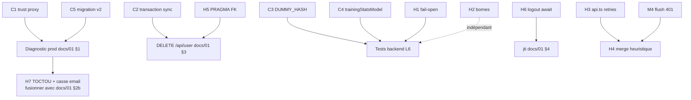

# 08 — Audit « vibecoding » complet (backend + frontend)

> Réalisé le 31/08/2026, code lu en profondeur. Hypothèse de travail : le projet a été généré par IA (Claude/OpenCode) → recherche systématique des faiblesses typiques : protections *déclarées mais inopérantes*, divergences PG/SQLite, transactions cassées, heuristiques de merge naïves, validation incomplète, endpoints morts mais dangereux.
> **AUCUNE modification n'a été faite.** Chaque constat contient : extrait de code, explication, correction proposée, fichiers impactés, protocole de test.
>
> Légende sévérité : 🔴 Critique (perte de données / panne prod / faille) · 🟠 Élevé · 🟡 Moyen · ⚪ Dette

---

## Résumé exécutif

| ID | Sévérité | Constat | Fichier principal |
|----|----------|---------|-------------------|
| C1 | 🔴 | `trust proxy` absent → express-rate-limit v8 casse ou mutualise les IP derrière Render — **cause plausible de la panne auth prod** | backend/src/index.js |
| C2 | 🔴 | Transaction PG factice dans `replaceAllByUser` → un échec à mi-parcours = **suppression définitive de tous les répertoires** de l'utilisateur | backend/src/models/repertoireModel.js |
| C3 | 🔴 | `DUMMY_HASH` invalide → la protection timing-attack revendiquée est **inopérante** | backend/src/services/authService.js |
| C4 | 🔴 | `trainingStatsModel` écrit du SQL PostgreSQL pur → **crash garanti en local SQLite** | backend/src/models/trainingStatsModel.js |
| C5 | 🔴 | Schéma DDL ≠ schéma prod (migration jamais exécutée) — déjà documenté | backend/src/db.js + docs/01 |
| H1 | 🟠 | `isTokenRevoked` **fail-open** : DB en panne = tokens révoqués acceptés | backend/src/services/authService.js |
| H2 | 🟠 | Body 20 Mo + validation sans bornes (nodes, fen, san, reports, settings) → DoS stockage/CPU | index.js + validators |
| H3 | 🟠 | `apiRequest` réessaie les POST sur plusieurs URLs → doublons ; gestion 429 morte | src/services/api.ts |
| H4 | 🟠 | Merge multi-appareils par « qui a le plus de nœuds » → les suppressions **ressuscitent** | src/services/authService.ts |
| H5 | 🟠 | `PRAGMA foreign_keys` jamais activé → les `ON DELETE CASCADE` **ne font rien en SQLite** | backend/src/db.js |
| H6 | 🟠 | Logout fire-and-forget + erreurs avalées + fallback 8h incohérent avec TTL 24h | backend/src/services/authService.js |
| H7 | 🟠 | Signup check-then-insert (TOCTOU) + emails sensibles à la casse | authService.js + userModel.js |
| M1-M9 | 🟡 | Voir section détaillée | divers |
| L1-L8 | ⚪ | Voir section dette | divers |

**Lecture recommandée** : C1 d'abord (explique potentiellement la prod cassée), puis C2 (risque de perte de données actif), puis le reste dans l'ordre.

### Addendum — passe de vérification approfondie (même jour)
Faits supplémentaires **vérifiés dans le code** lors de la seconde passe :
- **H4 aggravé** : `updatedAt` n'est JAMAIS estampillé côté front → le merge est à 100 % « le plus gros gagne » (détail dans H4)
- **M6 requalifié** : `AccountModal` est du code mort inatteignable (aucun appelant) → suppression pure
- **Bug tutoriel élucidé** (4 défauts + confusion de numérotation) → docs/06 §1
- `vercel.json` a déjà le fallback SPA ✅ ; `JWT_SECRET` est fail-fast au boot ✅ ; `storage.ts` try/catch partout ✅ ; `DB_PATH=:memory:` fonctionne pour les tests ✅ ; les deux `openings.json` sont identiques (SHA-256) ; `GET /api/health` n'existe pas ; `StrictMode` actif (effets doublés en dev — piège de repro pour le tutoriel)

---

# 🔴 CRITIQUES

## C1. `trust proxy` absent — panne rate-limiter derrière le proxy Render

### Code concerné
[backend/src/index.js](../backend/src/index.js) — aucun `app.set('trust proxy', …)` nulle part (vérifié par recherche exhaustive), alors que le backend tourne derrière le proxy de Render, et que [backend/src/middleware/rateLimiters.js](../backend/src/middleware/rateLimiters.js) utilise `express-rate-limit@^8.4.1` :

```js
// rateLimiters.js — dépend de req.ip
const WHITELIST_IPS = ['127.0.0.1', '::1', '::ffff:127.0.0.1'];
const skipLocal = (req) => WHITELIST_IPS.includes(req.ip);
const authLimiter = rateLimit({ windowMs: 15 * 60 * 1000, max: 10, skip: skipLocal, ... });
```

### Problème (explication)
Render place un reverse-proxy devant le service et transmet l'IP réelle dans l'en-tête `X-Forwarded-For`. Sans `app.set('trust proxy', N)`, Express ignore cet en-tête. Deux conséquences :
1. **express-rate-limit ≥ v7 détecte cette incohérence** (header XFF présent + trust proxy désactivé) et lève l'erreur de validation `ERR_ERL_UNEXPECTED_X_FORWARDED_FOR` → les routes rate-limitées (`/signup`, `/login`, stats, SSE) répondent **500**. C'est un candidat très sérieux pour expliquer la panne « accès comptes » en prod, en concurrence avec la migration non exécutée (docs/01 §1). Les deux peuvent coexister.
2. Même si la validation était désactivée, `req.ip` = IP du proxy Render → **tous les utilisateurs partagent le même compteur** : 10 tentatives de login/15 min pour la planète entière = lockout global dès qu'il y a 2 visiteurs.

### Correction proposée
Dans `index.js`, juste après `const app = express()` :
```js
// Render ajoute exactement 1 proxy devant le service
app.set('trust proxy', 1);
```
⚠️ Ne PAS mettre `true` (ferait confiance à n'importe quel client qui forge un XFF → contournement du rate limiting). La valeur `1` = « fais confiance à un seul saut de proxy ».

### Fichiers impactés
- [backend/src/index.js](../backend/src/index.js) (1 ligne)
- Aucun autre — `skipLocal` continuera de fonctionner en local (pas de proxy → `req.ip` local).

### Protocole de test
1. **Diagnostic préalable** : logs Render → chercher `ERR_ERL_UNEXPECTED_X_FORWARDED_FOR` ou `ValidationError` — confirme/infirme que c'est LA cause de la panne
2. Local : `npm run dev` backend → 11 logins ratés depuis une IP non-whitelistée (utiliser `curl` avec `--interface` ou tester depuis un autre appareil du LAN) → 429 au 11e
3. Prod après fix : 2 appareils sur des réseaux différents → chacun a son propre compteur (l'un peut se prendre un 429 sans bloquer l'autre)
4. Prod : vérifier que `curl -H "X-Forwarded-For: 1.2.3.4"` ne permet PAS de réinitialiser son compteur (le header du client est écrasé par celui de Render)

---

## C2. Transaction PG factice dans `replaceAllByUser` — perte totale possible des répertoires

### Code concerné
[backend/src/models/repertoireModel.js](../backend/src/models/repertoireModel.js#L92-L109) :

```js
async function replaceAllByUser(userId, payloads) {
  const now = new Date().toISOString();
  await withTransaction(async () => {            // ← le callback IGNORE le paramètre client
    await run(getDb(), 'DELETE FROM repertoires WHERE "userId" = ?', [userId]);
    for (const payload of payloads) {
      ...
      await run(getDb(), 'INSERT INTO repertoires ...', [...]);  // ← passe par le POOL
    }
  });
  ...
}
```
et [backend/src/db.js](../backend/src/db.js#L285-L301) :
```js
async function withTransaction(fn) {
  if (USE_PG) {
    const client = await db.connect();
    await client.query('BEGIN');
    const result = await fn(client);   // ← fn reçoit client… mais ne l'utilise pas
    await client.query('COMMIT');
    ...
```

### Problème (explication)
En PostgreSQL, une transaction n'existe que **sur la connexion qui a émis `BEGIN`**. Ici, `withTransaction` ouvre un client dédié et fait `BEGIN`/`COMMIT` dessus — mais le callback exécute le `DELETE` et les `INSERT` via `run(getDb(), …)`, qui utilise **le pool global** (`db.query`), donc d'autres connexions en autocommit. Résultat :
- Le `BEGIN`/`COMMIT` encadrent… rien du tout.
- **Si un `INSERT` échoue au milieu** (payload invalide, contrainte, coupure réseau, OOM), le `DELETE` initial est **déjà commité** → tous les répertoires de l'utilisateur sont détruits, les insertions partielles restent, aucun rollback. Perte de données irréversible (et pas de backups, cf. docs/02).
- En SQLite le bug est invisible (connexion unique) — divergence local/prod typique du vibecoding : « testé en local, ça marche ».

Le même piège est évité dans `bulkInsertPlayerStats` (db.js), qui utilise correctement `client.query` — preuve que les deux morceaux ont été générés à des moments différents sans revue croisée.

**Aggravant** : l'endpoint `PUT /api/repertoires/sync` qui appelle ce code est toujours monté ([backend/src/routes/repertoireRoutes.js](../backend/src/routes/repertoireRoutes.js#L8)) alors que **le frontend actuel ne l'appelle plus** (vérifié : `src/services/authService.ts` n'utilise que GET/POST/PUT/:id/DELETE/:id). C'est un endpoint mort, destructif par conception (remplace TOUT par ce que le client envoie), accessible à tout utilisateur authentifié.

### Corrections proposées (deux options)
- **Option A (recommandée)** : supprimer l'endpoint `PUT /sync` + `syncRepertoires` (controller) + `replaceAllRepertoires` (service) + `replaceAllByUser` (model). Le sync incrémental par répertoire couvre déjà tout. Moins de code = moins de risque.
- **Option B** (si on veut le garder pour un futur import massif) : corriger la transaction en propageant le client :
  ```js
  await withTransaction(async (client) => {
    await runOn(client, 'DELETE FROM repertoires WHERE "userId" = ?', [userId]);
    for (const payload of payloads) {
      await runOn(client, 'INSERT INTO repertoires ...', [...]);
    }
  });
  // avec dans db.js un helper :
  async function runOn(client, sql, params) {
    if (USE_PG) { const res = await client.query(convertPlaceholders(sql), params);
                  return { lastID: res.rows[0]?.id, changes: res.rowCount }; }
    return sqliteRun(stripReturning(sql), params);  // SQLite : connexion unique, OK
  }
  ```
  Et remplacer le DELETE-all par un *upsert + delete différentiel* pour ne jamais avoir de fenêtre destructive.

### Fichiers impactés
- Option A : [repertoireRoutes.js](../backend/src/routes/repertoireRoutes.js), [repertoireController.js](../backend/src/controllers/repertoireController.js), [repertoireService.js](../backend/src/services/repertoireService.js), [repertoireModel.js](../backend/src/models/repertoireModel.js), [repertoireValidator.js](../backend/src/validators/repertoireValidator.js) (`repertoireSyncSchema` reste utilisé par `convert-guest` → le garder)
- Vérifier : `convertGuest` ([authService.js](../backend/src/services/authService.js#L113-L124)) utilise `createRepertoire` en boucle, PAS `replaceAllByUser` → non affecté ✅

### Protocole de test
1. Avant tout : **backup manuel** (docs/02 §1)
2. Option A : `grep -rn "repertoires/sync" src/` → 0 résultat côté front (déjà vérifié) → suppression sans risque ; tester création/édition/suppression de répertoire après
3. Option B : test d'intégration qui envoie un lot dont le 3e payload viole une contrainte → vérifier que les répertoires d'origine sont **intacts** après le 500

---

## C3. Protection timing-attack revendiquée mais inopérante (`DUMMY_HASH` invalide)

### Code concerné
[backend/src/services/authService.js](../backend/src/services/authService.js#L48-L50) :

```js
// Hash factice utilisé pour maintenir un temps de réponse constant
// même quand l'identifiant n'existe pas (protection timing attack — OWASP)
const DUMMY_HASH = '$2b$12$invalidhashfortimingprotectionXXXXXXXXXXXXXXX';
...
const passwordMatch = await bcrypt.compare(password, user?.passwordHash ?? DUMMY_HASH);
```

### Problème (explication)
Un hash bcrypt valide fait exactement `$2b$12$` + **53 caractères** (22 de sel + 31 de hash) dans l'alphabet base64 bcrypt. La chaîne ici fait 45 caractères après le préfixe → **hash malformé**. `bcrypt.compare` avec un hash invalide **retourne `false` immédiatement** sans effectuer les ~250 ms de calcul des 12 rounds. La différence de temps de réponse (~2 ms vs ~250 ms) permet à un attaquant de distinguer « utilisateur inexistant » de « mauvais mot de passe » → énumération des comptes, exactement ce que le commentaire prétend empêcher. C'est le pattern vibecoding par excellence : *le commentaire décrit l'intention, le code ne la réalise pas*, et aucun test ne le vérifie.

### Correction proposée
Générer un vrai hash une fois au démarrage (coût : un hash au boot) :
```js
let DUMMY_HASH = '$2b$12$C6UzMDM.H6dfI/f/IKcEeO6dOxJHFwWkynyLDqaZL9DAOcgOw6ZMG'; // vrai hash de secours
bcrypt.hash('dummy-timing-protection', 12).then(h => { DUMMY_HASH = h; }).catch(() => {});
```
Ou plus simple et déterministe : remplacer la constante par un hash réellement généré (`node -e "require('bcrypt').hash('x',12).then(console.log)"`) et collé en dur — il n'a pas besoin d'être secret, juste **structurellement valide**.

### Fichiers impactés
- [backend/src/services/authService.js](../backend/src/services/authService.js) uniquement.

### Protocole de test
```js
// test unitaire à ajouter (backend, vitest) :
const t0 = Date.now(); await bcrypt.compare('x', DUMMY_HASH); const dt = Date.now() - t0;
expect(dt).toBeGreaterThan(50); // un compare bcrypt 12 rounds prend > 50 ms
```
Manuel : mesurer `curl -w '%{time_total}'` sur `/api/auth/login` avec (a) un username inexistant, (b) un username existant + mauvais mdp → les temps doivent être comparables (±20 %).

---

## C4. `trainingStatsModel` : SQL PostgreSQL pur → crash en local SQLite

### Code concerné
[backend/src/models/trainingStatsModel.js](../backend/src/models/trainingStatsModel.js) :

```js
async function updateBestScore(userId, repertoireId, variantKey, score) {
  const db = getDb();
  await db.query(                                  // ← .query n'existe PAS sur sqlite3.Database
    `INSERT INTO training_stats (...) VALUES ($1, $2, $3, $4, NOW())   -- ← $n et NOW() = PG only
     ON CONFLICT ("userId", "variantKey") DO UPDATE
       SET "bestSurvivalScore" = GREATEST(...), "updatedAt" = NOW()`,  -- ← GREATEST/NOW() PG
    [userId, repertoireId || null, variantKey, score]
  );
}
```

### Problème (explication)
Tout le reste du backend passe par les wrappers `run`/`get`/`all` de `db.js` qui abstraient PG vs SQLite (conversion `?`→`$n`, strip du `RETURNING`). Ce fichier-ci contourne l'abstraction et appelle `db.query` directement :
- **En local (SQLite)** : `sqlite3.Database` n'a pas de méthode `.query` → `TypeError: db.query is not a function` → **toutes les stats d'entraînement sont cassées en dev** (500 sur POST/GET `/api/training-stats`). Si personne ne l'a remarqué, c'est que les stats ne sont pas testées en local — signal d'alerte en soi.
- En prod PG : fonctionne. Divergence dev/prod silencieuse = les régressions ne se voient qu'en prod.

### Correction proposée
Réécrire avec les wrappers + SQL portable :
```js
const { getDb, run, get } = require('../db');

async function updateBestScore(userId, repertoireId, variantKey, score) {
  const now = new Date().toISOString();
  // ON CONFLICT DO UPDATE + MAX() portable (SQLite ≥ 3.24 le supporte)
  await run(getDb(),
    `INSERT INTO training_stats ("userId", "repertoireId", "variantKey", "bestSurvivalScore", "updatedAt")
     VALUES (?, ?, ?, ?, ?)
     ON CONFLICT ("userId", "variantKey") DO UPDATE
       SET "bestSurvivalScore" = MAX(training_stats."bestSurvivalScore", excluded."bestSurvivalScore"),
           "updatedAt" = excluded."updatedAt"`,
    [userId, repertoireId || null, variantKey, score, now]);
}
```
⚠️ Piège : `GREATEST` (PG) vs `MAX(a,b)` scalaire (SQLite). PG accepte aussi `GREATEST` mais pas `MAX(a,b)` à 2 arguments hors agrégat. Deux options :
- **Option A** : requêtes distinctes par moteur (comme `bulkInsertPlayerStats` le fait déjà) — explicite et sûr
- **Option B** : SELECT préalable + INSERT/UPDATE conditionnel via les wrappers — portable mais 2 requêtes

Note : le DDL SQLite de `training_stats` utilise `"updatedAt" TEXT DEFAULT (datetime('now'))` et le DDL PG `TIMESTAMP DEFAULT NOW()` — passer une valeur ISO explicite (comme ci-dessus) neutralise la divergence.

### Fichiers impactés
- [backend/src/models/trainingStatsModel.js](../backend/src/models/trainingStatsModel.js)
- [backend/src/controllers/trainingStatsController.js](../backend/src/controllers/trainingStatsController.js) (voir aussi M8 : validation absente)

### Protocole de test
1. Local SQLite : POST `/api/training-stats` `{variantKey:'test', score:5}` → 200 (aujourd'hui : 500)
2. POST score 3 puis score 7 puis score 5 → GET → `bestSurvivalScore = 7` (le MAX est conservé)
3. Prod PG : même séquence sur un compte test

---

## C5. Dérive de schéma prod (rappel)

Déjà documenté en détail dans [docs/01-auth-comptes.md](01-auth-comptes.md) §1-2 : les DDL de [db.js](../backend/src/db.js#L34-L44) déclarent `phone`, `emailVerified`, `check_contact_required` mais `CREATE TABLE IF NOT EXISTS` ne modifie jamais une table existante → la table prod est restée à l'ancienne version. À traiter via `migrate-v2-email-only.sql`. **Ajout de cet audit** : C1 est une cause concurrente de la panne — diagnostiquer les deux dans les logs Render avant de conclure.

---

# 🟠 ÉLEVÉS

## H1. `isTokenRevoked` fail-open

### Code
[backend/src/services/authService.js](../backend/src/services/authService.js#L22-L30) :
```js
async function isTokenRevoked(token) {
  try {
    const row = await get(getDb(), 'SELECT token FROM revoked_tokens WHERE token = ?', [token]);
    return !!row;
  } catch {
    return false;   // ← DB en panne = « pas révoqué » = accès autorisé
  }
}
```

### Problème
Un contrôle de sécurité doit être **fail-closed**. Si la DB est momentanément indisponible, tous les tokens révoqués (logout, futur changement de mot de passe docs/01 §3) redeviennent valides. En pratique l'impact est limité (si la DB est down, `findById` dans le middleware échouera juste après), mais le *pattern* est dangereux : le jour où on met du cache devant `findById`, la faille s'ouvre en grand.

### Correction
```js
} catch (err) {
  console.error('[auth] revocation check failed:', err.message);
  const e = new Error('Service temporarily unavailable');
  e.statusCode = 503;
  throw e;   // fail-closed : refuser en cas de doute
}
```
Et dans [authMiddleware.js](../backend/src/middleware/authMiddleware.js), laisser remonter le 503 au lieu du 401 générique (le catch global actuel transformerait tout en 401 « Invalid or expired token » → l'utilisateur croirait sa session expirée pendant une simple micro-coupure DB).

### Test
Arrêter la DB locale → appel authentifié → attendu 503 (pas 200, pas 401).

---

## H2. Absence de bornes : body 20 Mo, nœuds illimités, reports illimités

### Code
- [backend/src/index.js](../backend/src/index.js#L41) : `app.use(express.json({ limit: '20mb' }))`
- [backend/src/validators/repertoireValidator.js](../backend/src/validators/repertoireValidator.js) : `fen: z.string().min(1)` (pas de max !), `san: z.string().min(1)` (pas de max !), `nodes: z.array(...).min(1)` (pas de max !), `repertoires: z.array(...)` (pas de max !)
- [chesscomStatsRoutes.js](../backend/src/routes/chesscomStatsRoutes.js#L229-L238) : `POST /report/save` — `params`/`data` non validés, non bornés, **aucun rate limiter** sur cette route, pas de quota par utilisateur
- [userSettingsController.js](../backend/src/controllers/userSettingsController.js) : clés filtrées ✅ mais **valeurs** non bornées

### Problème
Un utilisateur authentifié (ou un compte-jetable créé pour ça) peut :
1. Envoyer des répertoires de 20 Mo avec des `fen` d'1 Mo chacun → zod parse 20 Mo de JSON de façon **synchrone** → event-loop bloquée plusieurs secondes (DoS du service single-instance Render Free) ;
2. Sauvegarder des reports de 20 Mo en boucle → la DB Render Free (1 Go) se remplit en ~50 requêtes → **panne de toute l'application** (plus aucune écriture possible).

### Corrections proposées
```js
// index.js — un répertoire d'échecs sérialisé dépasse rarement 2 Mo
app.use(express.json({ limit: '3mb' }));
```
```js
// repertoireValidator.js — bornes réalistes
san: z.string().min(1).max(12),              // le plus long SAN légal : 'exd8=Q#' etc.
fen: z.string().min(1).max(100),             // un FEN fait ~60-90 chars
nodes: z.array(serializedRepertoireNodeSchema).min(1).max(20000),
repertoires: z.array(serializedRepertoireSchema).max(100),
```
```js
// chesscomStatsRoutes.js — /report/save
router.post('/report/save', authMiddleware, reportLimiter, async (req, res) => {   // + limiter existant
  const json = JSON.stringify(data);
  if (json.length > 2_000_000) return res.status(413).json({ error: 'Rapport trop volumineux' });
  // + quota : garder les N derniers rapports par user
  // DELETE FROM saved_reports WHERE "userId" = ? AND id NOT IN (SELECT id ... ORDER BY "createdAt" DESC LIMIT 20)
```
⚠️ **Avant de réduire la limite à 3 Mo** : vérifier la taille réelle du plus gros répertoire existant en prod (`SELECT "userId", LENGTH(payload) FROM repertoires ORDER BY 2 DESC LIMIT 5;`). Si un utilisateur légitime dépasse, ajuster.

### Fichiers impactés
index.js, repertoireValidator.js, chesscomStatsRoutes.js, userSettingsController.js (borner `JSON.stringify(merged).length` à ~100 Ko). Côté front, rien à changer (les payloads légitimes sont loin des bornes).

### Test
1. POST répertoire avec un `fen` de 10 000 chars → 400 zod (aujourd'hui : 201)
2. POST `/report/save` 21 fois → les 20 plus récents seulement en base
3. POST body de 5 Mo → 413

---

## H3. `apiRequest` : retries multi-URL sur POST + gestion 429 morte

### Code
[src/services/api.ts](../src/services/api.ts#L60-L100) :
```ts
for (const baseUrl of apiCandidates) {
  try {
    const response = await fetch(url, {...});
    if (!response.ok) {
      if (response.status === 401 || response.status === 409 || response.status === 429) {
        const error = ...; error.status = response.status;
        throw error;                       // ← lancé DANS le try…
      }
      networkErrors.push(...); continue;   // 500, 503… → URL suivante
    }
    ...
  } catch (error: any) {
    if (error?.status === 401 || error?.status === 409) throw error;  // ← …mais 429 N'est PAS relancé ici
    networkErrors.push(...);               // → le 429 est avalé et on réessaie l'URL suivante !
  }
}
```

### Problèmes
1. **Le 429 est avalé** : lancé ligne 74, rattrapé ligne 90, non relancé (la condition ne teste que 401/409) → au lieu d'afficher « trop de tentatives », le client **réessaie immédiatement sur l'URL suivante** (qui pointe le même backend via le rewrite Vercel) → aggrave le rate limiting et affiche « serveur inaccessible » à l'utilisateur. Le message d'erreur 429 spécifique dans `loginWithCredentials` ([authService.ts](../src/services/authService.ts#L307)) est donc du **code mort**.
2. **Rejeu de requêtes non idempotentes** : si `POST /repertoires` répond 500 après avoir inséré (ou si le premier candidat timeout côté client mais aboutit côté serveur), la boucle rejoue le POST sur le candidat suivant → **répertoire dupliqué en base**. En prod, candidats = `VITE_API_URL` (Render direct) + `origin/api` (rewrite Vercel → même Render) : le même serveur est appelé deux fois.

### Corrections proposées
```ts
} catch (error: any) {
  if (error?.status) throw error;          // TOUTE erreur HTTP identifiée sort de la boucle
  networkErrors.push(...);                 // seules les vraies erreurs réseau tentent l'URL suivante
}
```
Et pour l'idempotence, deux options :
- **Option A (simple)** : ne parcourir les candidats multiples que pour `method === 'GET'` ; pour POST/PUT/DELETE, n'utiliser que le premier candidat résolu (le `preferredApiBaseUrl` mémorisé par un GET antérieur — le bootstrap fait toujours un GET `/auth/me` d'abord, donc le préféré est déjà connu).
- **Option B (robuste, post-v1)** : header `Idempotency-Key` généré par requête + table de déduplication côté serveur. Surdimensionné pour ce projet.

### Fichiers impactés
- [src/services/api.ts](../src/services/api.ts) seul. Les appelants ([authService.ts](../src/services/authService.ts), stats.ts, report.ts) bénéficient sans changement — vérifier ensuite que les branches `error?.status === 429` de `loginWithCredentials` s'activent bien.

### Test
1. Local : couper le backend → GET → message « serveur inaccessible » après épuisement des candidats ✅ (comportement conservé)
2. Provoquer un 429 (11 logins) → le message « Trop de tentatives » doit s'afficher (aujourd'hui : « Serveur inaccessible »)
3. Simuler un 500 sur POST (arrêter la DB, garder le serveur) → vérifier qu'UN seul répertoire est créé côté serveur quand la DB revient (aujourd'hui : risque de doublon)

---

## H4. Heuristique de merge « le plus gros gagne » — les suppressions ressuscitent

### Code
[src/services/authService.ts](../src/services/authService.ts#L243-L249) :
```ts
function shouldPreferLocal(local: RepertoireNode, remote: RepertoireNode): boolean {
  const localNodes = countNodes(local);
  const remoteNodes = countNodes(remote);
  if (localNodes !== remoteNodes) return localNodes > remoteNodes;   // ← taille avant fraîcheur !
  return (local.updatedAt ?? 0) > (remote.updatedAt ?? 0);
}
```

### Problèmes
1. **Le nombre de nœuds prime sur la date** : scénario concret — l'utilisateur élague 30 coups obsolètes sur son PC (device A, sync OK). Il ouvre l'app sur son téléphone (device B) resté sur l'ancienne version locale plus grosse → `localNodes > remoteNodes` → **la vieille copie écrase le nettoyage** et est re-marquée dirty → re-synchée vers le serveur. Toute suppression volontaire est réversible par n'importe quel appareil retardataire. C'est l'anti-pattern classique du merge « on ne perd jamais rien » qui, en réalité, perd les *intentions de suppression*.
2. **Comparaison de dates morte — VÉRIFIÉ à la passe MAX** : `local.updatedAt ?? 0` — or **aucun code frontend n'écrit jamais `node.updatedAt`** (recherche exhaustive : le seul write approchant est `trainingMedalUpdatedAt` dans training.ts:149 ; `scheduleRepertoireSync` ne fait que `markDirty`, authService.ts:531-539). La sérialisation préserve le champ s'il existe (authService.ts:42/84) mais rien ne le crée → les deux côtés valent `undefined` → `0 > 0` = false → **la comparaison de fraîcheur ne départage jamais rien : le merge est à 100 % « le plus gros gagne »**. Le serveur, lui, a un vrai mécanisme (`repertoireModel.js:118-120` compare `clientUpdatedAt` à `updatedAt` serveur, transporté par `serverUpdatedAtMap` côté front) — c'est la fondation à réutiliser.

### Correction proposée
Inverser la priorité : **la fraîcheur d'abord**, la taille comme simple départage :
```ts
function shouldPreferLocal(local: RepertoireNode, remote: RepertoireNode): boolean {
  const lt = toEpoch(local.updatedAt);   // helper qui normalise number | string ISO → epoch
  const rt = toEpoch(remote.updatedAt);
  if (lt !== rt) return lt > rt;
  return countNodes(local) > countNodes(remote);  // égalité de date : garder le plus complet
}
```
**Prérequis désormais CONFIRMÉ comme non satisfait** : l'estampillage n'existe pas (cf. point 2). Le fix se fait donc en deux temps obligatoires : **(1)** stamper `root.updatedAt = Date.now()` à chaque mutation — l'endroit unique et naturel est `scheduleRepertoireSync()` (authService.ts:531, appelé par les ~12 points de mutation de repertoire.ts/contextMenu.ts/pgn.ts) juste à côté du `markDirty` ; **(2)** seulement ensuite, inverser la priorité date>taille. Déployer (1) quelques jours AVANT (2) pour que les copies locales des utilisateurs acquièrent des timestamps. Sinon → **Option B** : conserver l'heuristique actuelle MAIS afficher la modale de choix existante ([uiStore + resolveConflict](../src/services/authService.ts#L594-L628)) quand les deux versions divergent — la solution la plus honnête.

### Test
1. Device A : supprimer une variante → sync → vérifier en DB que le payload serveur est réduit
2. Device B (avec l'ancienne copie locale) : ouvrir l'app → la variante supprimée ne doit PAS réapparaître
3. Mode avion sur B, ajouter des coups, reconnecter → les ajouts de B doivent survivre (ne pas casser le cas légitime !)

---

## H5. `PRAGMA foreign_keys` jamais activé — cascades mortes en SQLite

### Code
[backend/src/db.js](../backend/src/db.js#L110) : seul `PRAGMA journal_mode=WAL` est exécuté. SQLite désactive `foreign_keys` **par défaut** (héritage historique), et le driver `sqlite3` ne l'active pas non plus.

### Problème
Tous les `ON DELETE CASCADE` des DDL SQLite ([db.js](../backend/src/db.js#L126-L180)) sont **décoratifs** en local : supprimer un user laisserait des `repertoires`, `training_stats`, `user_settings`, `player_stats_cache`, `saved_reports` orphelins. Aujourd'hui aucun code ne supprime de user, mais le futur `DELETE /api/user` (docs/01 §3, obligation RGPD) **compte précisément sur ces cascades** → en dev il semblerait marcher (la ligne user disparaît) mais laisserait toutes les données personnelles en base. Et les FK ne sont pas non plus *vérifiées* : un `INSERT` avec un `userId` bidon passe en SQLite, échoue en PG → nouvelle divergence dev/prod.

### Correction
```js
// initSqlite(), juste après le WAL :
await sqliteRun('PRAGMA foreign_keys=ON');
```
(1 ligne ; le pragma est par-connexion, et il n'y a qu'une connexion SQLite ici.)

### Test
Local : créer un user test avec répertoires → `DELETE FROM users WHERE id = ?` en SQL direct → `SELECT COUNT(*) FROM repertoires WHERE "userId" = ?` → 0 attendu (aujourd'hui : les lignes restent).

---

## H6. Logout best-effort : révocation non attendue, erreurs avalées, TTL incohérent

### Code
[backend/src/services/authService.js](../backend/src/services/authService.js#L9-L20 et #L107-L111) :
```js
async function revokeToken(token) {
  ...
  const expiresAt = payload?.exp ? ... : new Date(Date.now() + 8 * 60 * 60 * 1000).toISOString();
                                        // ← fallback 8h alors que tokenTTL = 24h (config.js:17)
  try { await run(...); } catch { /* Ignorer les erreurs de révocation */ }
}
function logout(token) {
  if (token) { revokeToken(token); }    // ← pas de await : fire-and-forget
}
```

### Problèmes
1. `logout` n'attend pas `revokeToken` → le contrôleur répond « Logged out successfully » **avant** que la révocation soit en base. Si l'INSERT échoue (ou si le process meurt entre les deux), le token reste valide jusqu'à 24 h. L'utilisateur croit être déconnecté partout.
2. Le `catch {}` silencieux masque toute panne de révocation — même pas un log.
3. Fallback `8h` incohérent avec le TTL réel de 24 h : un token malformé mais révoqué sortirait de `revoked_tokens` 16 h trop tôt (cas limite, mais révélateur du copier-coller entre versions).

### Correction
```js
async function logout(token) {
  if (!token) return;
  await revokeToken(token);       // + dans revokeToken : log en cas d'échec au lieu du silence
}
// authController.logout devient async + await, avec try/catch → 500 si la révocation échoue
// (l'utilisateur DOIT savoir que sa déconnexion n'a pas pris effet)
```
Et aligner le fallback sur `tokenTTL` importé de config plutôt qu'un `8h` en dur. À terme, la révocation par `jti` (docs/01 §4) remplace le stockage du token complet en clair dans `revoked_tokens` (au passage : stocker le token entier en base est un mini-risque en soi — un dump de cette table donne des sessions valides ; le `jti` règle aussi ça).

### Test
Logout → réutiliser immédiatement le même token sur `/api/auth/me` → 401 « Token has been revoked », de façon fiable sur 10 essais consécutifs.

---

## H7. Signup TOCTOU + casse des emails

### Code
[backend/src/services/authService.js](../backend/src/services/authService.js#L52-L80) : `findByUsername` → `findByEmail` → `findByPhone` → `createUser` (4 requêtes non atomiques). [userModel.js](../backend/src/models/userModel.js) : `WHERE email = ?` sans normalisation.

### Problèmes
1. **Race condition** : deux signups simultanés avec le même username passent tous deux les checks → le second `INSERT` viole la contrainte `UNIQUE` → erreur PG brute → **500** au lieu d'un 409 propre. Faible probabilité, mais le double-clic sur « Créer un compte » (si le bouton n'est pas désactivé assez vite) suffit à le déclencher.
2. **Casse** : `Foo@Bar.com` et `foo@bar.com` créent deux comptes distincts, et le login est sensible à la casse de l'email — source de « je n'arrive pas à me connecter » impossible à diagnostiquer.

### Correction
1. Garder les checks (pour les messages propres) mais **rattraper aussi la violation d'unicité** :
   ```js
   try { user = await userModel.createUser(...); }
   catch (err) {
     if (err.code === '23505' /* PG unique_violation */ ||
         String(err.message).includes('UNIQUE constraint failed')) {   // SQLite
       const e = new Error('Username or email already in use'); e.statusCode = 409; throw e;
     }
     throw err;
   }
   ```
2. Normaliser : `email.trim().toLowerCase()` au signup ET au login (prévu dans docs/01 §2b — cet audit confirme la nécessité). ⚠️ Migration : vérifier d'abord qu'il n'existe pas déjà deux comptes prod ne différant que par la casse (`SELECT LOWER(email), COUNT(*) FROM users WHERE email IS NOT NULL GROUP BY 1 HAVING COUNT(*) > 1;`) — s'il y en a, les traiter manuellement avant d'ajouter un index `UNIQUE (LOWER(email))`.

### Test
Vitest backend : 2 × `signup` en `Promise.all` avec le même username → l'un 201, l'autre 409 (jamais 500). Signup `Foo@X.com` puis login `foo@x.com` → 200.

---

# 🟡 MOYENS

## M1. CORS artisanal : header unique, pas de `Vary: Origin`, préflight permissif
[backend/src/index.js](../backend/src/index.js#L42-L50) : `Access-Control-Allow-Origin` renvoyé **inconditionnellement** avec la valeur configurée, même si l'`Origin` de la requête ne correspond pas ; `OPTIONS` répond toujours 204. Pas exploitable tel quel (une seule origin autorisée), mais fragile : le passage multi-origins prévu pour Capacitor (docs/04 §3e) doit impérativement remplacer ce bloc par la version conditionnelle avec `Vary: Origin` (sinon les caches CDN serviraient le mauvais header). **À faire en même temps que docs/04 §3e — ne pas corriger deux fois.**

## M2. `convertGuest` : boucle best-effort silencieuse et sans plafond
[backend/src/services/authService.js](../backend/src/services/authService.js#L113-L124) : chaque échec d'insertion est avalé (`catch {}`) — l'utilisateur qui migre 10 répertoires d'invité peut en perdre 3 sans aucun signal (le front affiche juste `count`). Correction : collecter les erreurs et renvoyer `{ count, failed: [...] }` ; le front ([authService.ts](../src/services/authService.ts#L389-L400)) affiche un toast si `failed.length > 0`. Plafonner : `repertoires: z.array(...).max(50)` (déjà couvert par H2).

## M3. `/api/training-stats` sans validation zod
[trainingStatsController.js](../backend/src/controllers/trainingStatsController.js) : `variantKey` non borné (chaîne de 20 Mo possible), `score` accepte `NaN`/`Infinity`/`1e300` (`typeof NaN === 'number'` → `Math.floor(NaN)` → erreur DB 500 ; `1e300` → dépassement `INTEGER` PG → 500), `repertoireId` non vérifié comme appartenant à l'utilisateur (un user peut référencer le répertoire d'un autre — intégrité, pas confidentialité). Correction : schéma zod `{ variantKey: z.string().min(1).max(200), score: z.number().int().min(0).max(10000), repertoireId: z.number().int().positive().optional() }` + vérification d'appartenance si `repertoireId` fourni.

## M4. Bootstrap : flush avec un token expiré + clearDirty destructif
[src/services/authService.ts](../src/services/authService.ts#L213-L217) : sur 401 au bootstrap, le code lance `_flushDirtyRepertoires()` **avec le token qui vient d'être refusé** → chaque PUT va re-401 → et le handler 401 du flush ([ligne ~511](../src/services/authService.ts#L508-L513)) fait `store.clearDirty(localId)` → **les modifications locales non synchronisées sont définitivement démarquées** ; après reconnexion, elles ne seront re-synchées que si `shouldPreferLocal` les repêche (aléatoire, cf. H4). Correction : sur 401 au bootstrap, ne PAS flusher ; conserver les dirty flags (ils sont dans le store) et re-flusher après le prochain login réussi (`finalizeAuthenticatedSession` : si `dirtyIds.size > 0` après `_applyServerRepertoires`, appeler `_flushDirtyRepertoires()`).

## M5. `finalizeAuthenticatedSession` avale les erreurs non-401
[src/services/authService.ts](../src/services/authService.ts#L402-L409) : si le GET `/repertoires` post-login échoue (500, timeout), le catch ne fait **rien** → l'utilisateur est « connecté » avec un store vide, sans message. S'il crée alors un répertoire, tout paraît normal… jusqu'au prochain bootstrap où le serveur renverra ses vrais répertoires et où le merge H4 décidera du survivant. Correction : dans ce catch, `setSyncStatus('error', 'Impossible de charger vos répertoires — rechargez la page')` + ne pas appeler `initializeService()` avec un état incomplet.

## M6. `AccountModal` : code mort confirmé
[src/components/modals/AccountModal.tsx](../src/components/modals/AccountModal.tsx) sauve un « pseudo » dans `localStorage['alphaChess.username']` — vestige de l'ère vanilla. **Vérifié à la passe MAX** : le type `{ type: 'account' }` est déclaré (types/ui.ts:26) et enregistré dans ModalPortal (ligne 43), mais **aucun `openModal({type:'account'})` n'existe nulle part** → la modale est inatteignable. Correction : suppression pure en 3 endroits — le composant, l'entrée `'account'` de ModalPortal.tsx:43, le membre d'union de types/ui.ts:26 (TypeScript signalera tout oubli).

## M7. Clés localStorage héritées et token dupliqué
Trois emplacements coexistent : le persist zustand `alphaChess-auth` (actif), les clés legacy `alphaChess.authToken`/`alphaChess.authUser` (lues en migration au bootstrap, [authService.ts](../src/services/authService.ts#L183-L191), mais nettoyées seulement dans la branche 401), et `STORAGE_KEYS.AUTH_TOKEN = 'alphaChess.token'` ([storage.ts](../src/services/storage.ts#L11)) apparemment orpheline. Correction : après migration réussie, `clearState('alphaChess.authToken')` immédiatement ; supprimer `AUTH_TOKEN` de STORAGE_KEYS si `grep -rn "AUTH_TOKEN" src/` ne montre aucun autre usage. Risque si on ne fait rien : un vieux token traîne indéfiniment dans le localStorage (surface de vol de session inutile).

## M8. `errorHandler` : messages internes exposés hors prod et 4xx verbeux
[backend/src/utils/errorHandler.js](../backend/src/utils/errorHandler.js) ne masque que les 5xx **et seulement si `NODE_ENV === 'production'`**. Vérifier que la variable est bien définie sur Render (Render ne la définit PAS automatiquement pour les services Node → dashboard → Environment → `NODE_ENV=production`). Sans elle : stack de messages PG bruts renvoyés aux clients (noms de tables, contraintes). Test : provoquer une erreur DB en prod → la réponse doit être `{"error":"Erreur interne du serveur"}`.

## M9. JWT : payload contient l'email
[authService.js](../backend/src/services/authService.js#L32-L34) : `jwt.sign({ sub: user.id, email: user.email })` — l'email (donnée personnelle) voyage dans un token stocké en localStorage et loggé potentiellement par des proxys. Il n'est jamais lu côté serveur (le middleware recharge le user par `sub`). Correction triviale : retirer `email` du payload. Aucun impact (vérifier quand même : `grep -rn "payload.email\|\.email" backend/src/middleware/`).

---

# ⚪ DETTE TECHNIQUE (rappels et compléments)

| # | Constat | Référence |
|---|---------|-----------|
| L1 | 38 occurrences `any`/`as any` concentrées dans [src/services/authService.ts](../src/services/authService.ts) et [src/services/stats.ts](../src/services/stats.ts) — précisément les fichiers où les bugs H3/H4/M4/M5 vivent. Typer `serializeRepertoire`/`deserializeFromServer` avec une interface `SerializedRepertoire` partagée éliminerait la classe d'erreurs « format inattendu » | docs/06 |
| L2 | console.log de debug (5 emplacements) | docs/06 §2 |
| L3 | Code legacy `js/`, `engine/`, `data/openings.json` dupliqué | docs/06 §3 |
| L4 | `chess.js@^0.10.3` backend (usage réel : [chesscomPlayerStatsService.js](../backend/src/services/chesscomPlayerStatsService.js#L3) uniquement — upgrade ^1.x = adapter ce seul fichier) vs `^1.3` front | docs/06 §4a |
| L5 | `nodemon@^2` (v3 dispo), `sqlite3@^5.1.6` (binaire natif, souvent en retard de patchs) → `npm audit` dans les deux packages ; `npm outdated` | docs/07 §4 |
| L6 | Zéro test backend — les bugs C2/C3/C4 de cet audit auraient tous été attrapés par 10 tests d'intégration | docs/06 §4b |
| L7 | `tokenTTL: '24h'` vs SECURITE.md qui dit 8h | docs/01 §4 |
| L8 | `revoked_tokens` stocke le JWT complet en clair comme PK (dump DB = sessions volables + index énorme) → migrer vers `jti` | docs/01 §4 |
| L9 | Caches en mémoire module-level dans chesscomPlayerStatsService (`gamesCache` 5 entrées × jusqu'à 10 000 parties) — OK sur instance unique Render, à revoir si scaling ; perdu à chaque redéploiement (comportement, pas bug) | — |
| L10 | `User-Agent: 'Blundertale/1.0 (contact: christophe)'` — mettre une vraie adresse de contact (les API Lichess/Chess.com bannissent les UA non identifiables en cas d'abus) | lichessStatsService.js#L10, chesscomPlayerStatsService.js#L17 |

---

# Comparaison prod (PostgreSQL) vs local (SQLite)

Divergences relevées — chacune est un vecteur de « ça marche chez moi » :

| Sujet | Local SQLite | Prod PG | Risque |
|---|---|---|---|
| `training_stats` | 💥 crash (`db.query` inexistant) | ✅ | C4 — stats non testables en dev |
| Transactions `replaceAllByUser` | ✅ (connexion unique) | 💥 factices | C2 — perte de données invisible en dev |
| FK / cascades | ❌ désactivées (pragma) | ✅ actives | H5 — RGPD/suppression |
| Schéma `users` | Neuf (avec phone/checks) | Ancien (migration non exécutée) | C5 — signup 500 en prod seulement |
| `RETURNING id` | Retiré par `stripReturning` | Natif | ✅ géré |
| Placeholders | `?` natifs | Convertis en `$n` | ✅ géré (sauf trainingStatsModel qui contourne) |
| `NOW()` / `datetime('now')` | DDL différent | DDL différent | OK tant que les valeurs sont passées en ISO explicite |
| Rate limiter | `skipLocal` → désactivé | Actif mais cassé (C1) | Les 429 ne sont jamais vus en dev |

**Recommandation structurelle** : interdire tout accès direct à `db.query`/`db.run` hors de `db.js` (règle simple à vérifier : `grep -rn "\.query(" backend/src --include=*.js | grep -v db.js` doit être vide). C'est LA barrière anti-divergence.

---

# Dépendances entre corrections (ordre d'exécution conseillé)



- **Lot 1 (avec docs/01, urgence prod)** : C1 + C5, puis H7 intégré à la migration email-only
- **Lot 2 (perte de données)** : C2 + H5 + H2 — avant d'implémenter la suppression de compte
- **Lot 3 (auth robuste)** : C3 + H1 + H6 + M9 — petit, groupable en un seul commit backend
- **Lot 4 (sync frontend)** : H3 puis M4/M5 puis H4 (le plus délicat — tester en dernier avec le protocole multi-appareils)
- **Lot 5 (hygiène)** : C4 + M3 + M2 + M6/M7 + dette L*

---

# Protocole de test global après corrections

1. **Suite backend nouvelle** (L6, vitest + supertest, SQLite `:memory:`) — cas minimum :
   - signup/login/logout nominaux + 409 doublon + 409 concurrent (H7) + timing DUMMY_HASH (C3)
   - révocation : logout → me → 401 (H6) ; DB coupée → 503 (H1)
   - repertoires : CRUD + payload hors bornes → 400 (H2) + transaction interrompue → données intactes (C2)
   - training-stats : POST/GET local SQLite (C4) + score NaN → 400 (M3)
2. **Front, tests manuels** : parcours docs/07 §2 (A à D) intégralement
3. **Multi-appareils** (H4/M4) : matrice 4 cas — {suppression sur A, ajout sur B} × {B en ligne, B hors ligne} → aucun cas ne doit ni ressusciter une suppression ni perdre un ajout
4. **Prod** : redéployer backend → logs Render propres (aucun `ERR_ERL`) → parcours A complet → `SELECT COUNT(*) FROM users;` avant/après pour vérifier zéro perte
5. **Charge basique** : 30 requêtes GET `/api/repertoires` en 10 s depuis un compte → aucune 500, latence stable (event-loop non bloquée)

---

# Ce qui est SAIN (à ne pas « corriger »)

Pour éviter qu'un futur agent ne « répare » ce qui fonctionne :
- ✅ Paramétrage SQL systématique (aucune injection trouvée, placeholders partout)
- ✅ Aucun `dangerouslySetInnerHTML` / `eval` / `innerHTML` dans src/ (vérifié)
- ✅ CSP helmet stricte et réfléchie (wasm-unsafe-eval nécessaire pour Stockfish)
- ✅ `encodeURIComponent` sur les entrées utilisateur dans les URLs sortantes (Lichess/Chess.com)
- ✅ Le wrapper Stockfish ([src/engine/sf-worker.ts](../src/engine/sf-worker.ts)) : debounce, stop-avant-go, gestion des bestmove périmés — c'est du travail soigné, ne pas y toucher sans raison
- ✅ `bulkInsertPlayerStats` : transaction PG correcte + batching SQLite réfléchi (modèle à suivre pour C2)
- ✅ Ownership vérifié sur repertoires/reports (`WHERE userId = ?` partout où c'est critique)
- ✅ bcrypt 12 rounds, zod aux frontières auth/repertoires, rate limiters différenciés (une fois C1 corrigé)
